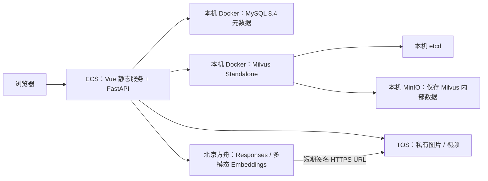

# 多模态数据检索平台

面向自动驾驶道路场景的图片、视频理解与检索演示平台。目标架构采用火山引擎 ECS、VPC、TOS 与方舟；MySQL 8 和 Milvus Standalone 以开源软件部署在同一台 ECS。

> 当前为架构迁移交付阶段，不代表生产接入完成。真实 TOS 与方舟凭证尚未提供，本机 Docker 基础设施也尚未在目标 ECS 实测；精确模型权限、视频支持和完整链路均待验证。单机部署不具备托管数据库的高可用和自动备份能力。

## 功能

| 能力 | 说明 |
|---|---|
| TOS 批量导入 | 输入 `tos://bucket/prefix/`，扫描图片和视频，跟踪处理状态 |
| 多模态标签 | 方舟 Responses 生成七类道路场景标签，支持人工编辑 |
| 文本与图片检索 | 方舟多模态向量化，Milvus 相似度检索 |
| 标签检索 | 分类筛选及 AND/OR 组合 |
| 用户与任务 | 用户配置、权限、进度、取消与幂等重试 |
| 媒体预览 | 私有 TOS 签名 HTTPS URL；视频 Range 播放 |

## 架构



| 组件 | 约定 |
|---|---|
| 前端 | Vue 3、TypeScript、Vite 7、Ant Design Vue、Pinia |
| 后端 | Python 3.11、FastAPI、SQLAlchemy、Uvicorn 单 worker |
| 元数据 | ECS 本机开源 MySQL 8.4 LTS，Docker 命名卷持久化 |
| 向量 | ECS 本机开源 Milvus Standalone；COSINE / HNSW，依赖本机 etcd 与 MinIO |
| 标签理解 | `POST /responses`，`doubao-seed-2-1-lite-260915` |
| 向量化 | `POST /embeddings/multimodal`，`doubao-embedding-vision-251215` |
| 方舟地址 | `https://ark.cn-beijing.volces.com/api/v3` |
| 向量空间 | 显式 `dimensions: 1024`、`encoding_format: float`，单条媒体一个稠密向量 |
| 部署 | ECS + VPC + Docker Compose；数据库端口仅绑定 `127.0.0.1` |

不自动替换模型。更改模型、维度或入库指令版本必须新建集合并重新向量化，不能按维度相同判断兼容。相似度为 `clamp(cosine, 0, 1)`，文本阈值首期默认 0。

## 快速开始

先按[部署指南](deploy/DEPLOYMENT.md)准备 ECS、Docker、真实云资源、网络和授权。运行环境固定 Python 3.11、Node.js 22.12+（建议受支持 LTS）和 Docker Compose V2。脚本实际检查版本。

```bash
# 安装依赖并强制重新构建；不会读取或覆盖 backend/.env，也不会启动容器
PYTHON_BIN=python3.11 bash deploy/install.sh

# 运维在目标 ECS 安全配置 backend/.env；启动时先拉起本机 MySQL/Milvus
APP_ENV_FILE="$(pwd)/backend/.env" bash deploy/start.sh --daemon
bash deploy/stop.sh
bash deploy/infra.sh down # 可选：停止基础设施，不删除数据卷
```

应用支持直接注入环境变量；仅当显式设置 `APP_ENV_FILE` 时加载指定配置文件。配置模板为 [`backend/.env.example`](backend/.env.example)，不得将真实配置、密钥和证书打入发布包。已有 `backend/.env` 必须由运维自行确认，安装脚本不创建、不覆盖它。

前端默认 `http://<ECS>:3000`，后端仅监听 `127.0.0.1:8000`；前端静态服务代理 `/api/`。MySQL `3306`、Milvus `19530/9091` 和后端端口只绑定本机；生产入口应配置 HTTPS 并限制访问来源。

### 本地开发

本地开发不走发布脚本，而是直接运行热更新的 Vite 与 Uvicorn；基础设施仍复用 `deploy/infra.sh`。

```bash
# 1. 复制模板并填写 JWT_SECRET_KEY、DEFAULT_ADMIN_PASSWORD、MYSQL_PASSWORD、
#    INFRA_* 三个值，以及两个位于仓库之外、权限 0700 的 ANNOTATION_*_DIR
cp backend/.env.example backend/.env

# 2. Python 3.11 虚拟环境与依赖（含离线测试依赖）
python3.11 -m venv backend/venv
backend/venv/bin/pip install -r backend/requirements-test.txt

# 3. 前端依赖
(cd frontend && npm ci)

# 4. 本机 MySQL / etcd / MinIO / Milvus
bash deploy/infra.sh up

# 5. 后端（127.0.0.1:8000）与前端开发服务器（默认 3000，/api 代理到后端）
(cd backend && APP_ENV_FILE="$PWD/.env" ./venv/bin/python -m uvicorn app.main:app --host 127.0.0.1 --port 8000)
(cd frontend && npm run dev)
```

离线测试：`backend/venv/bin/python -m pytest -c backend/pytest.ini backend/tests`、`(cd frontend && npm test && npm run type-check)`、`backend/venv/bin/python -m unittest deploy/test_infrastructure.py`。后端测试不读取 `backend/.env`，也不访问网络。

## 配置入口

| 配置族 | 关键字段 |
|---|---|
| TOS | `TOS_ACCESS_KEY_ID`、`TOS_ACCESS_KEY_SECRET`、`TOS_BUCKET_NAME`、`TOS_ENDPOINT`、`TOS_REGION`；可选临时令牌和自定义域名 |
| 方舟 | `ARK_API_KEY`、`ARK_BASE_URL`、`ARK_TAG_MODEL`、`ARK_EMBEDDING_MODEL` |
| 向量空间 | `EMBEDDING_DIMENSION=1024`、入库/查询指令版本、`MILVUS_COLLECTION` |
| Milvus | 默认 `http://127.0.0.1:19530`、`MILVUS_AUTH_ENABLED=false`、`MILVUS_SECURE=false` |
| MySQL | 默认 `127.0.0.1:3306`、`MYSQL_DATABASE`、`MYSQL_USER`、`MYSQL_PASSWORD`、`MYSQL_SSL_ENABLED=false` |
| 容器基础设施 | `INFRA_MYSQL_ROOT_PASSWORD`、`INFRA_MINIO_ROOT_USER`、`INFRA_MINIO_ROOT_PASSWORD` |
| 应用 | JWT、管理员密码、注册策略、任务并发/超时、方舟有限重试 |

具体键名、默认值、资源准备、迁移与回退步骤见[部署指南](deploy/DEPLOYMENT.md)。endpoint、bucket、账号和证书只能从实际控制台取得，示例不能证明可连接。

## 发布与迁移

```bash
# 只列候选文件，不构建、不安装、不读取真实配置、不连接云服务
bash deploy/pack.sh --list

# 前后端迁移完成后再执行：强制 npm ci + npm run build，然后打包
PYTHON_BIN=python3.11 bash deploy/pack.sh release

# 安装源默认 https://registry.npmjs.org，可改为已授权的火山制品仓库
# NPM_REGISTRY 仅用于依赖安装，不是运行时云服务配置
```

打包采用发布白名单，排除真实 `.env`、密钥/证书、迁移导出数据、日志、虚拟环境、`node_modules`、本地工具链和编辑器目录，只携带 `backend/.env.example`。静态清单中已有的 `dist` 不算新构建验证通过；真实打包没有跳过构建的选项。

存量迁移顺序：备份并保留源资源 → TOS 对象复制与显式 URI 映射 → 元数据导入 dry-run → 显式写入本机 MySQL → 方舟重新向量化到本机 Milvus 新集合 → 核验 → 前后端成套切换。旧向量和旧云凭证不可复用。回退恢复旧应用配置及原资源，不删源库或旧集合。

任务仍为单应用进程内执行，状态存 MySQL；重启中断任务需按失败状态幂等重试，并非自动恢复内存执行现场。本期不引入 Redis、消息队列或 Kubernetes。

## 目录

```text
backend/     FastAPI、业务模型、云适配、配置模板及迁移工具
frontend/    Vue 源码、静态服务与新构建的 dist
deploy/      Shell 流程、发布清单工具与部署指南
docs/        项目介绍、展示 HTML 与本地字体
```

文档展示材料使用 `docs/fonts/` 的本地字体，不请求外部字体服务；使用方式见[项目介绍](docs/项目介绍文档.md)。
